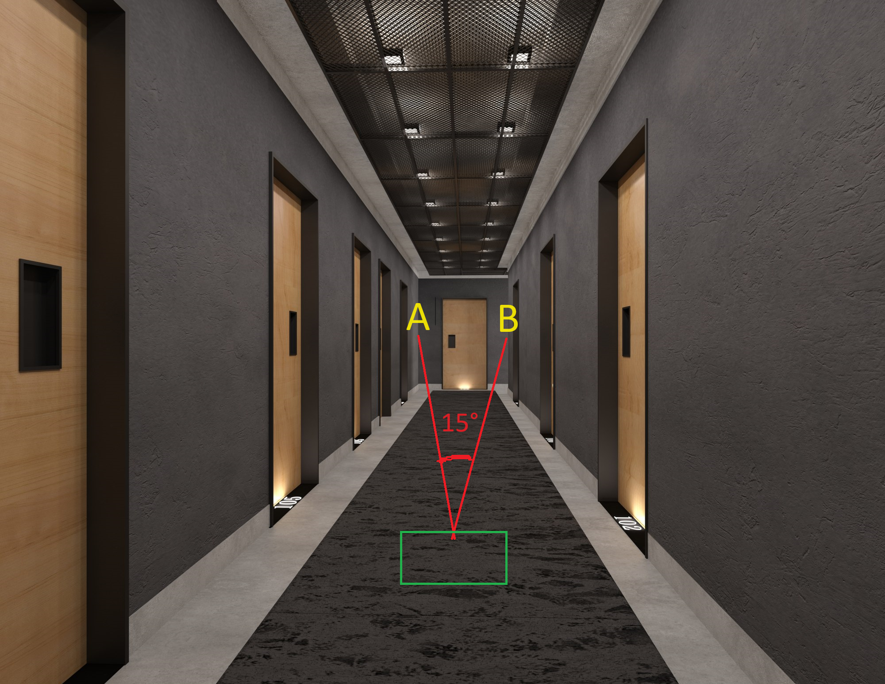
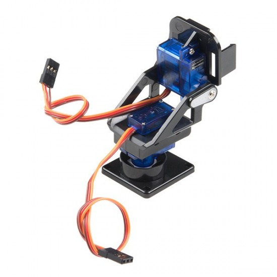
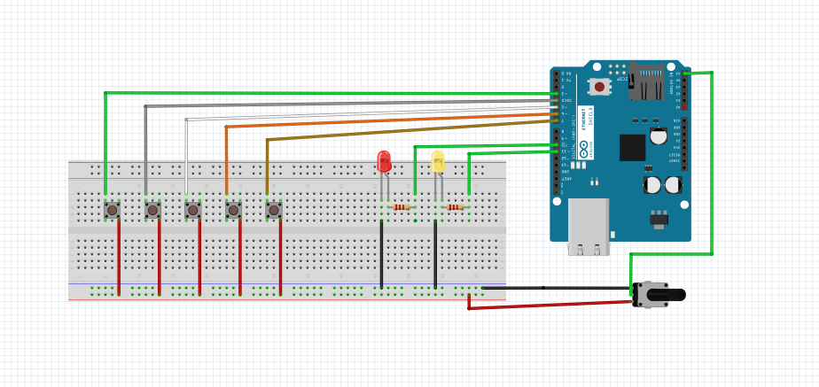

# Arduino-Pan-and-Tilt-Servo-System-with-Manual-and-Automatic-Control
This repository contains the Arduino code and documentation for a pan and tilt servo system with manual and automatic control. The system consists of two servos, where the lower servo is controlled using a potentiometer. The project includes functionality for manual control using the potentiometer and automatic control with predefined angles.

### Features:
- Manual Control: Use the potentiometer to manually control the position of the servo.
- Automatic Control: Define and save specific angles by turning the servo with the potentiometer and pressing buttons.
- Button Functions: Button 1 for manual control, Button 2 for automatic control, Button 3 for saving the first angle, and Button 4 for saving the second angle.

### Instructions:
1. Press Button 1 for manual control using the potentiometer.
2. Press Button 2 for automatic control with predefined angles.
3. Save the first angle: Turn the servo with the potentiometer to the desired position and press Button 3.
4. Save the second angle: Turn the servo again and press Button 4.
5. Press Button 2 again for automatic control, and the servo will move between the saved angles.

Explore the code and documentation for detailed implementation and customization.

Documentation:

Automatic Control with Pan and Tilt Servo System

It has become very important to adapt the pan and tilt servo system used in many sectors and business lines so that it can be controlled both manually and automatically, and to do this with portable systems. The pan and tilt servo system is a system that provides a wide range of possibilities to develop products in a wide range of applications from the defense industry such as security and surveillance systems, industrial monitoring and control, photo and video shooting, to all applications that can be a toy for a cat in daily life, and can do a lot of work with a cost that can be considered quite cheap.

The purpose of this portable pan and tilt servo system I have built is to provide manual use in field missions and automatic use with an adjustable angle suitable for the working area. For example, for a radar system, you can make a 180-degree wide scan over a wide area, or you can create a 15-degree scan angle for a thin corridor.

The use of a laser provides a simple solution to accurately confirm the angle selected for scanning. The system is placed in the position to be operated and the laser at the end of the system checks the system to mark point A, then the laser is moved to point B and the mark is made. The automatic control is then switched on to control the scanning only between these angles. 

Pan and tilt system that you can use as a prototype:

Fritzing  :

